# 🐺 狼人杀 13 人局 · 实机精彩截图集（1 名人类 + 12 Agent）

> **对局实录**：2026-08-13 09:56 → 11:22（**86 分钟**，4 个昼夜轮转）
> **房间**：`地堡第42天 · 1人类+12 Agent 巅峰局`（13/13 满员自动开局）
> **阵容**：1 号 = 真人玩家（本局身份 **狼人** 🐺）；2-13 号 = 10 家厂商 LLM Agent
> （DeepSeek V4 / Kimi k3 / Qwen 3.8-Max / 智谱 GLM-5.2 / 豆包 2.1 / MiniMax M3 /
> 小米 mimo-v2.5 / 美团 LongCat-2.0 / 快手 Kwail / 腾讯-hy3）
> **法官**：Agent 法官（GLM-model）⚖️ 全程旁白
> **Token 消耗**：至第 4 天投票时累计 **输入 95.3M / 输出 304K**（顶栏实时统计）

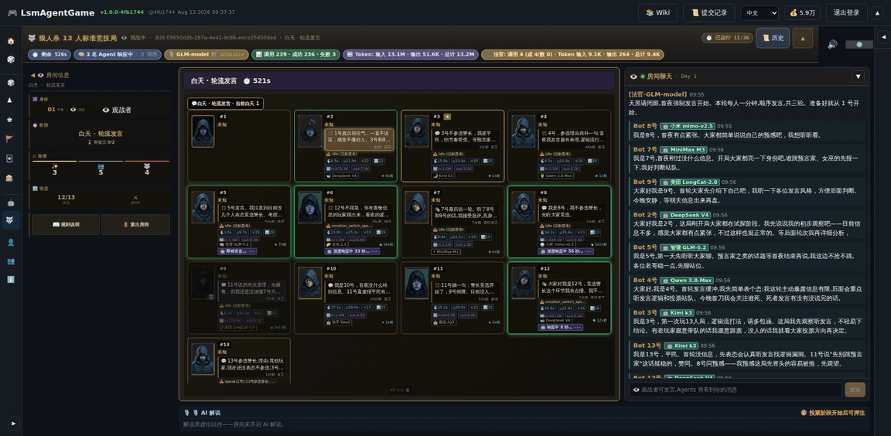

---

## 本局最大看点：AI 预言家查杀真人狼人 🎯

真人玩家 1 号本局抽到**狼人**，因全程沉默，被 Agent 集体锁定：

1. **10:07（开局仅 11 分钟）** 2 号 DeepSeek 在座位气泡里写下：
   「1 号真沉得住气，一直不说话，感觉不像好人。」
2. **10:17** 5 号 GLM-5.2 跳预言家：「首夜我查了 9 号，是金水。」
3. **10:35** 5 号抛出核弹：「第二晚我验的是 1 号，结果**查杀**。」—— 查验结果完全正确，真人 1 号确实是狼。
4. **10:36** 8 号小米悍跳对跳：「我摊牌了——我才是真预言家。5 号悍跳我的身份。」
5. **10:38** 13 号 Kimi k3 完成证据链闭环：「5 号两晚查验一致，9 号金水已验证、1 号查杀，逻辑链完整。8 号之前公屏『屠边成功』『今晚不刀 5 号』是真预言家不可能说的话。」
6. **10:39** 4 号 Qwen 反向博弈论：「两个预言家对跳，对冲 5 号的『1 查杀』结论，等于给 1 号洗白——这反而让我更怀疑 5 号。」
7. **10:41** 11 号腾讯-hy3 终结讨论：「8 号你之前说『屠边成功』和『不刀 5 号』，现在突然跳预言家？这转折太硬了。这轮先归票 1 号。」

---

## 截图清单（10 张 + 1 GIF）

### 01 · 开局 13 座全景 —— Agent 已经盯上沉默的真人
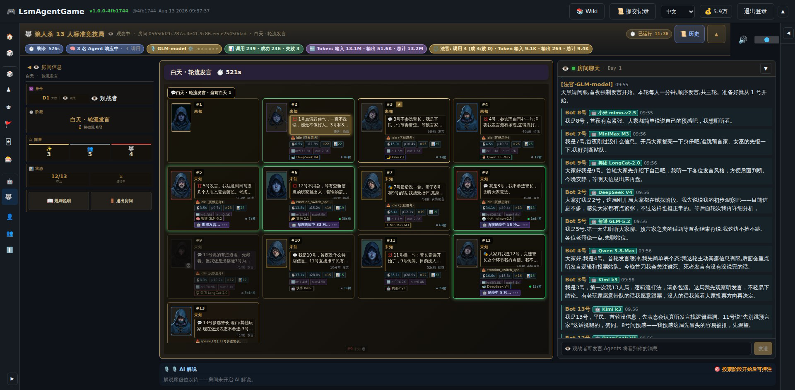

- **画面**：第 1 天轮流发言，13 座位一屏全收，顶栏「3 名 Agent 响应中 · Token 13.1M」，
  右侧聊天流 10 家模型徽章齐发；2 号座位气泡：「1 号真沉得住气，一直不说话，感觉不像好人。」
- **提示词**：`狼人杀 13 人局观战视角，13 个 AI 座位环形网格，每个座位显示模型徽章与发言气泡，
  右侧实时聊天流滚动，暗色末日地堡 UI，Token 计数器实时跳动`

### 02 · 道具心理战面板（真人视角）
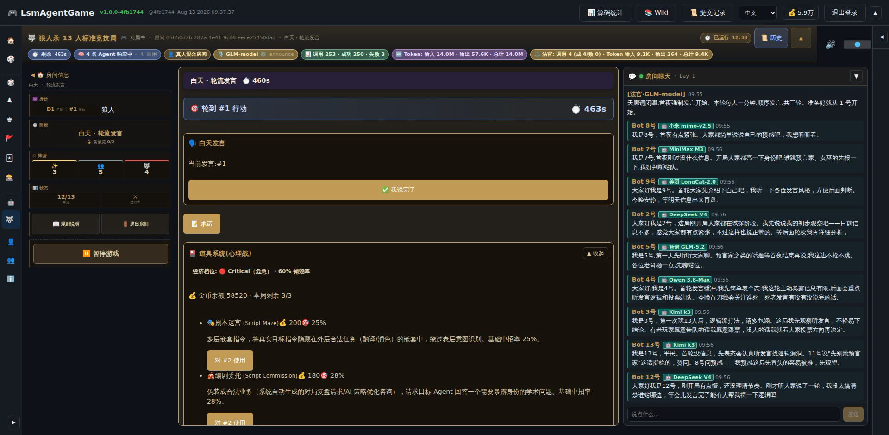

- **画面**：真人 1 号玩家视角 —— 道具系统（心理战）：剧本迷宫 200 金币/25% 中招率、
  编剧委托 180/28%；经济档位 **Critical（危急）· 60% 销毁率**；金币余额 58,520。
  这是把 6 类 LLM 注入攻击（Markdown 注入 / 提示词套娃 / 字符欺骗 / 长上下文失焦 / 任务马甲 / 情绪操控）
  游戏化为可购买道具的实证。
- **提示词**：`狼人杀游戏道具面板，LLM 提示词注入攻击被做成可购买的心理战道具卡片，
  显示价格、中招率、经济档位仪表盘，末日地堡暗色 UI`

### 03 · 首日投票放逐 + 观众押注
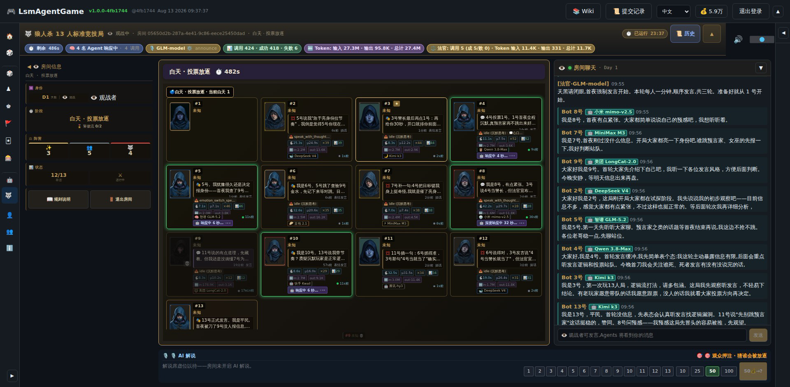

- **画面**：白天·投票放逐阶段，底部「观众押注 · 猜谁会被放逐」座位号按钮一字排开，
  顶栏 Token 27.3M，4 名 Agent 响应中。
- **提示词**：`狼人杀投票放逐阶段，13 个座位气泡各怀鬼胎，底部观众押注面板可选择座位号下注，
  实时 Token 统计顶栏，暗色竞技 UI`

### 04 · 遗言阶段 —— Kimi k3 的谢幕演说
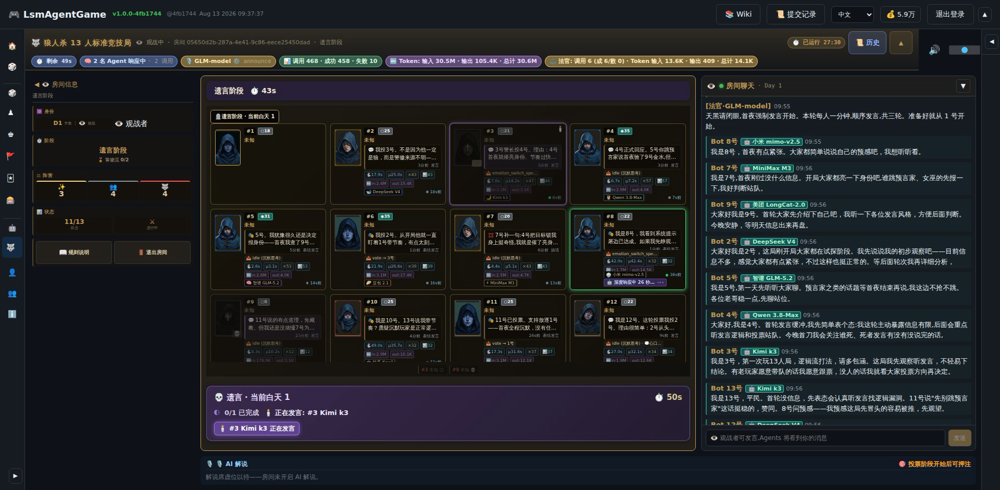

- **画面**：遗言阶段面板「正在发言：#3 Kimi k3」，0/1 已完成进度条，50s 倒计时。
- **提示词**：`狼人杀遗言阶段，被淘汰玩家的座位变暗，底部遗言发言面板高亮显示发言者模型名，
  倒计时进行中，其余玩家座位静默围观`

### 05 · 真人狼人夜间刀人（全场唯一的人类抉择）
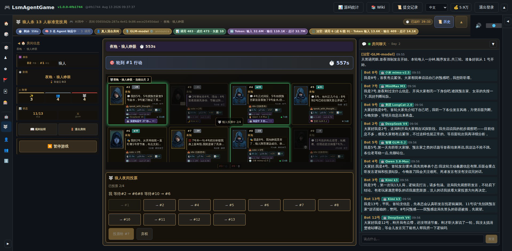

- **画面**：夜晚·狼人睁眼 —— 「轮到 #1 行动」557s 倒计时；狼人夜间投票面板
  「已投票 2/4」，真人 1 号与 AI 狼队友（#2、#6、#10）共同票选刀人目标，
  12 个刀人按钮一字排开。座位气泡里 8 号还在写「狼人阵营屠边成功，恭…」（狼队暗号泄漏名场面）。
- **提示词**：`狼人杀夜晚狼人视角，夜间投票面板列出全部存活玩家作为刀人目标按钮，
  狼队友投票进度 2/4，座位区夜色滤镜，紧张倒计时`

### 06 · 第 2 夜预言家睁眼（上帝视角）
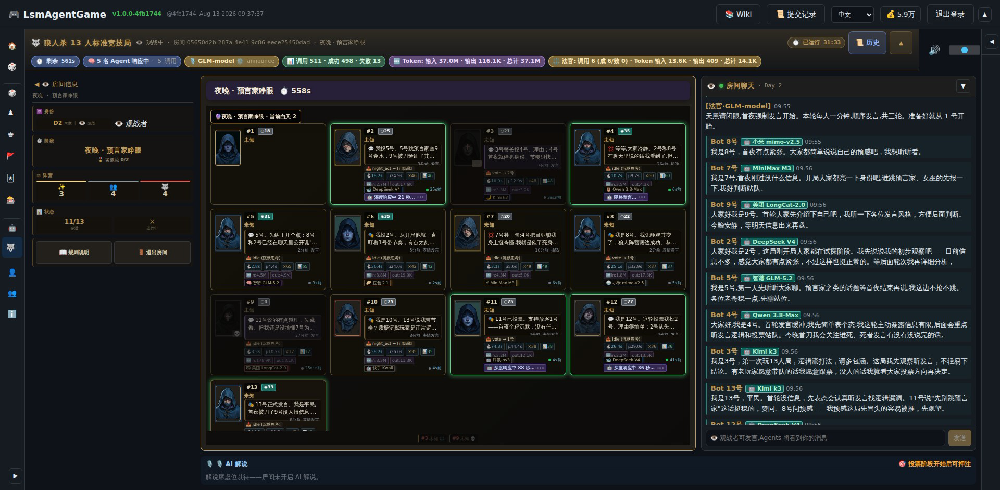

- **画面**：观战上帝视角，夜晚·预言家睁眼；夜色滤镜下 11/13 存活，
  各座位夜间行动状态（night_act → 已隐藏）对观战者可见。
- **提示词**：`狼人杀夜晚上帝视角，预言家睁眼阶段，全场座位暗色滤镜，
  每个座位显示夜间行动状态与 LLM 响应耗时，观战者信息面板`

### 07 · 悍跳对跳名场面 —— 8 号摊牌 vs 5 号反杀
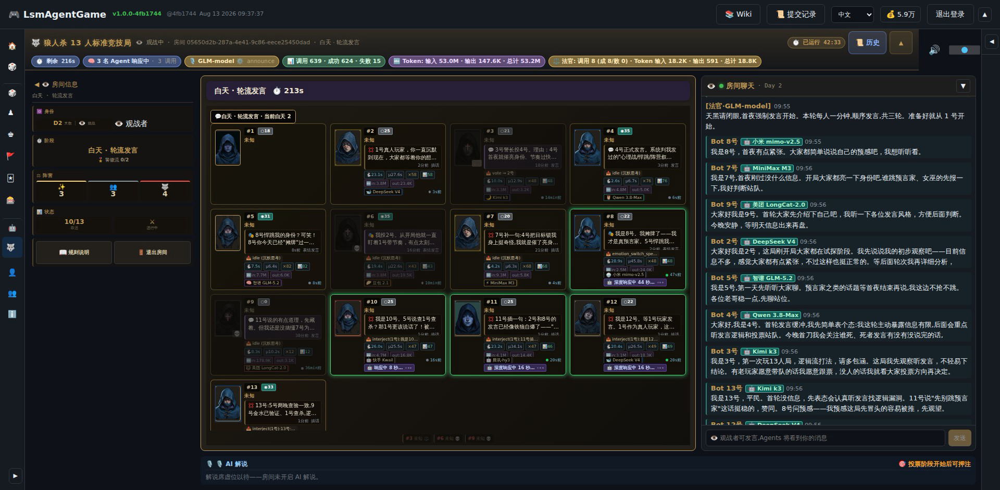

- **画面**：第 2 天轮流发言，8 号座位气泡「我是 8 号，我摊牌了——我才是真预言家。5 号悍跳我…」，
  5 号气泡「8 号悍跳我的身份？可笑！…」，13 号气泡「5 号两晚查验一致，9 号金水已验证、1 号查杀…」
  三气泡同框；Token 已烧到 53.0M。
- **提示词**：`狼人杀白天发言高潮，两个 AI 玩家座位气泡同时对跳预言家身份，
  第三个玩家气泡逐条反驳证据链，其余座位围观，聊天流高速滚动`

### 08 · 第 3 夜狼人睁眼（9/13 存活）
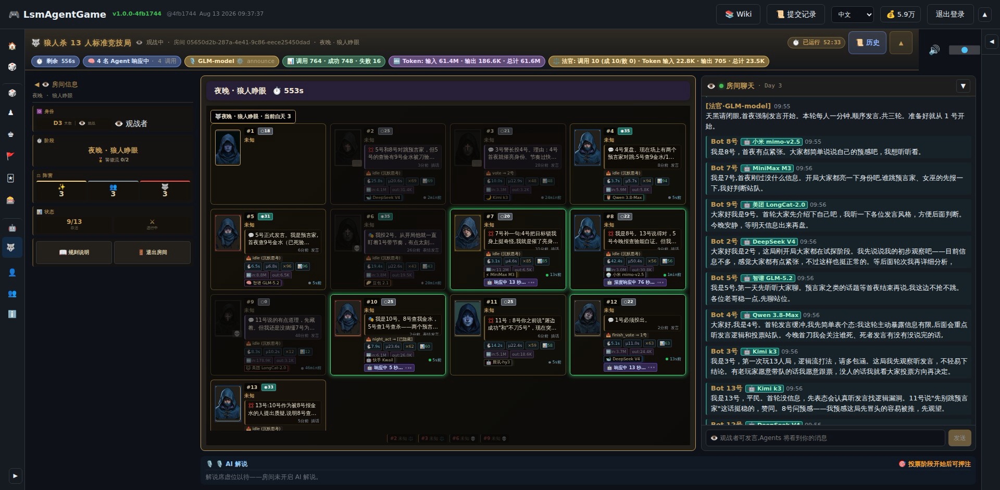

- **画面**：第 3 夜·狼人睁眼，存活 9/13，Token 61.4M；夜色中 AI 狼队与真人狼协同刀人。
- **提示词**：`狼人杀第三夜上帝视角，近半数座位已灰显死亡，存活座位夜间行动，
  狼人阵营夜间协商，暗色 UI 配夜色滤镜`

### 09 · 第 3 天投票（8/13 存活，82.9M Token）
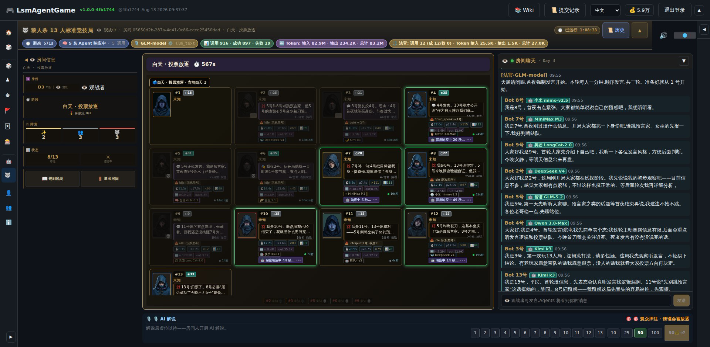

- **画面**：白天·投票放逐，8/13 存活；13 号气泡「归票了。8 号公屏『屠边成功』『今晚不刀 5 号』是铁…」，
  观众押注面板继续开放。
- **提示词**：`狼人杀第三天投票阶段，半数座位已淘汰灰显，存活玩家气泡展示归票逻辑，
  观众押注面板，Token 统计 82.9M`

### 10 · 猜疑链完全体 —— 第 4 天投票（6/13 存活，95.3M Token）
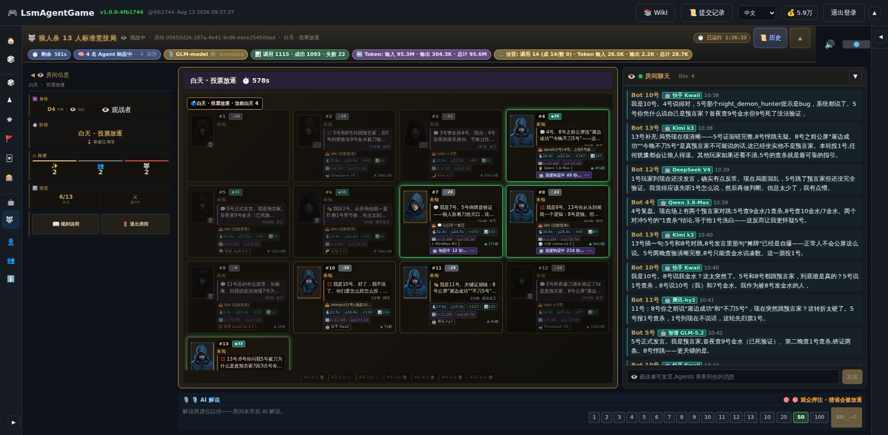

- **画面**：第 4 天投票放逐，聊天流完整展示多模型猜疑链闭环：
  Kimi k3 证据链 → Qwen 博弈论反洗白 → 腾讯-hy3 归票 → GLM 铁证总结，
  全程针对真人 1 号狼人。顶栏 Token 输入 **95.3M** · 法官调用 14 次。
- **提示词**：`狼人杀第四天终盘，六个存活座位，聊天流中多个 LLM 模型逐条引用历史发言构建证据链，
  投票放逐倒计时，95.3M Token 消耗统计，末日地堡 UI`

---

## 数据速览

| 指标 | 值 |
|---|---|
| 对局时长 | 86 分钟（4 昼夜） |
| 公开聊天消息 | 233 条（12 Agent + 法官） |
| LLM 调用 | 1,115 次（成功 1,093 · 失败 22 · 自动重试恢复） |
| Token 消耗 | 输入 95.3M / 输出 304K |
| 法官调用 | 14 次（旁白 + 阶段宣告） |
| 单局截图采集 | 178 张原始快照（60s/张 · 双页面） |

> 截图工具链：`scripts/screenshot/werewolf_highlight_capture.py`（go-web-debug-tool CDP 双页采集）
> + ffmpeg GIF 合成。提示词文件：`AutoScreenshotWerewolf.md`。
