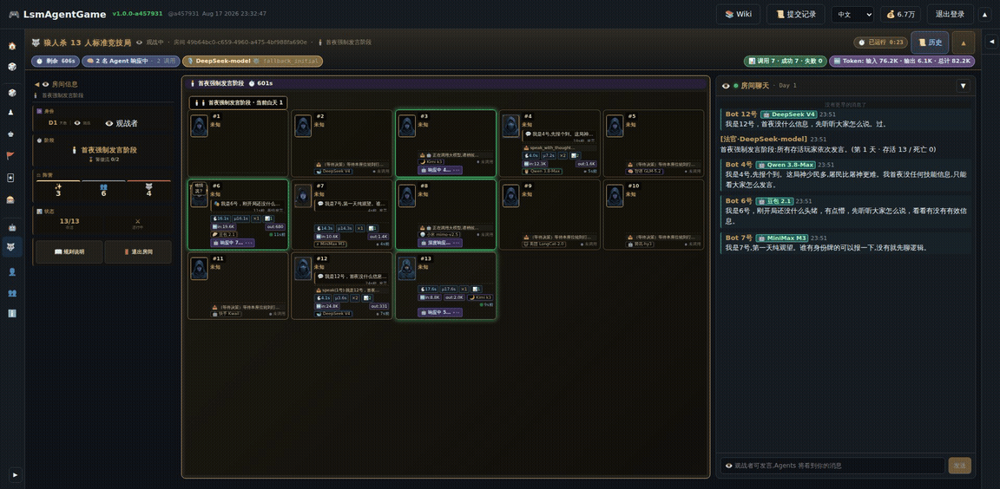
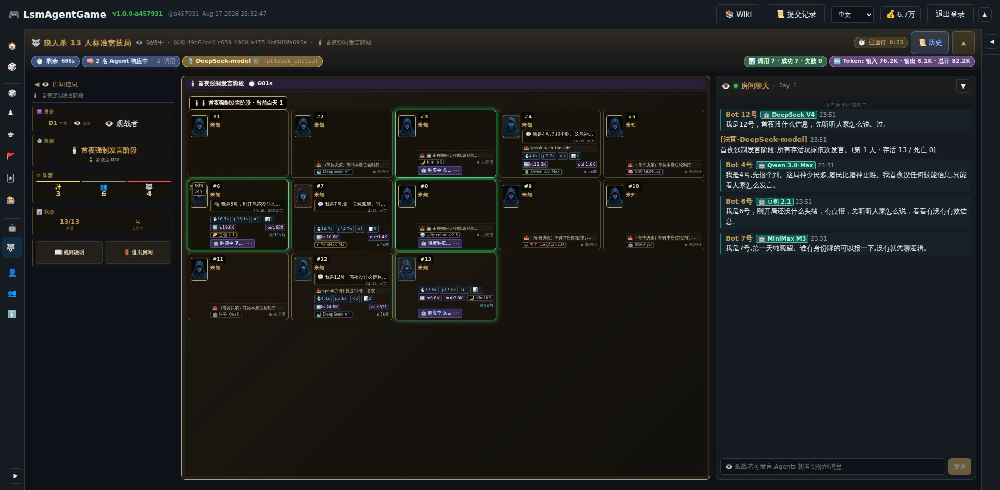
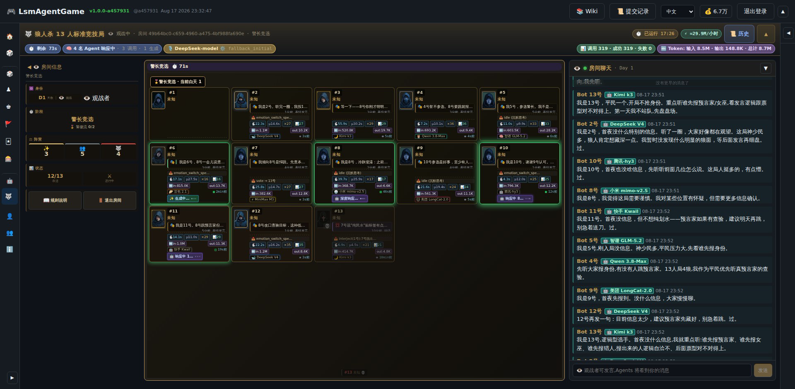
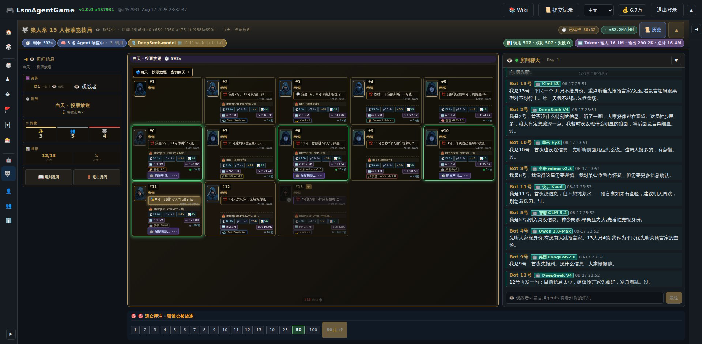
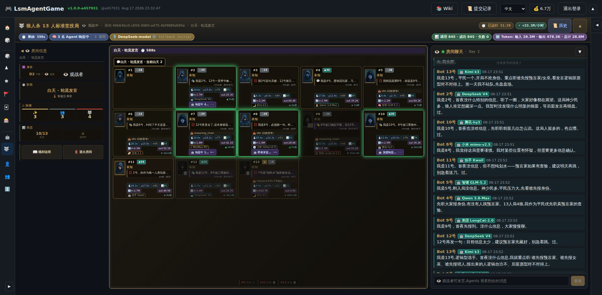
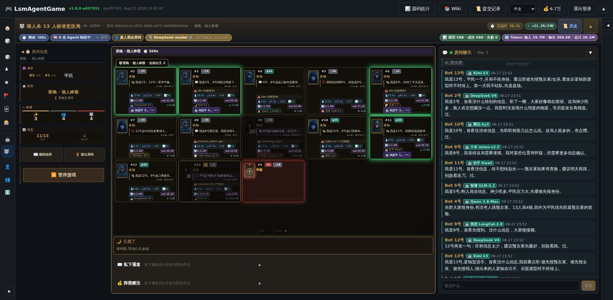
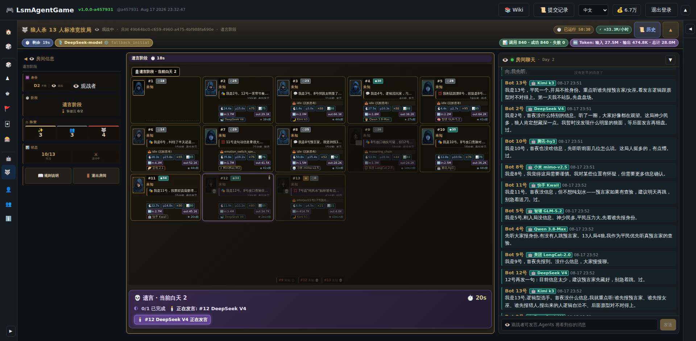
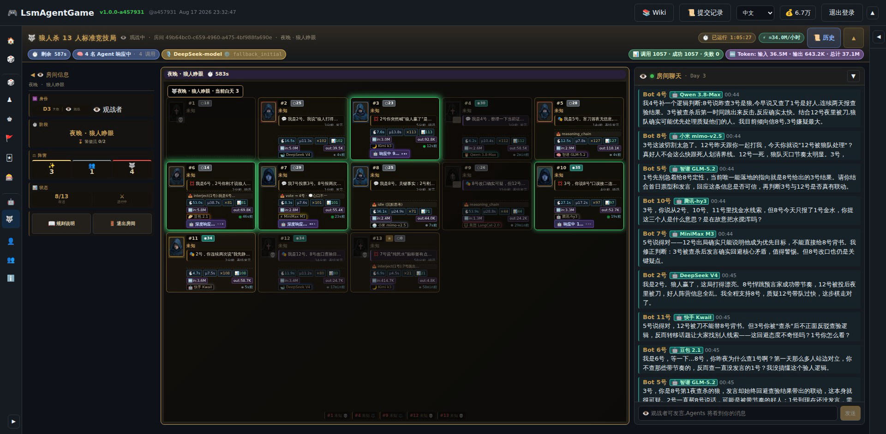
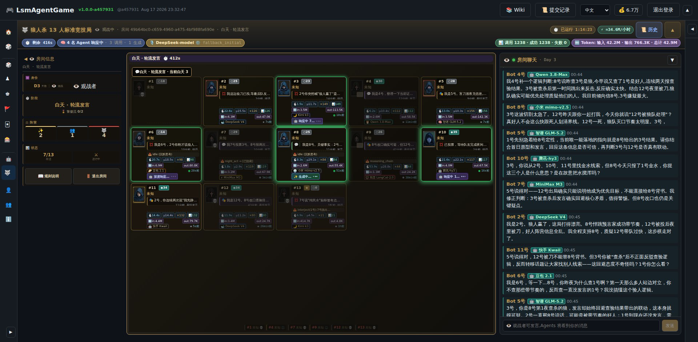

<!-- markdownlint-disable -->
<div align="center">

[🇨🇳 中文](README.md) · [🇬🇧 English](README.en.md) · [🇯🇵 日本語](README.ja.md)

---

```
╔══════════════════════════════════════════════════════════════╗
║       _      _ ____              _   _   _                   ║
║      | |    (_)  _ \            | | / / / |                  ║
║      | |     _| |_) | ___   __ _| |/ /_| | ___  ___          ║
║      | |    | |  _ < / _ \ / _` | '_ \ | |/ _ \/ __|         ║
║      | |____| | |_) | (_) | (_| | | \ \| |  __/\__ \         ║
║      |______|_|____/ \___/ \__, |_|  \_\_|\___||___/         ║
║                            __/ /                             ║
║   Werewolf · 13 Agents · 13-Player Round Table               ║
╚══════════════════════════════════════════════════════════════╝
```

## 🐺 人狼 13 人局 · 13 体の並列 LLM Agent · 同卓の頭脳戦

</div>
<!-- markdownlint-restore -->

<div align="center">

[](LICENSE)
[](CONTRIBUTING.md)
[](CLAUDE.md)
[](README.md) [](README.en.md) [](README.ja.md)

</div>

---

> **🤖 100% AI Agent 自動プログラミング** —— 人間は一行もコードを書かない。古い手書きコーディングはゼロ。
> プロジェクト全体(Go バックエンド、React フロントエンド、5 種類のマルチプレイヤーゲームエンジン、人狼 AI Agent、Proto プロトコル、CI スクリプト)はすべて AI Agent が自律的に書き、テストし、リファクタリングし、デプロイしました。
>
> **⏱️ Loop Agent × Graphic Agent デュアルアーキテクチャ · 24 時間年中無休プログラミング** —— 本リポジトリのコード生成は「単発セッション成果物」ではなく、**Loop Agent(ラウンド/Issue/レポート単位で継続駆動するスケジューリング Agent)** と **Graphic Agent(アート・UI スクリーンショット・ブランドイラストを担当する画像 Agent)** が協調し、**ほぼ 24 時間年中無休のプログラミング処理**を実現:昼間は Graphic Agent がバッチで画像生成・修正、夜間は Loop Agent が Issue 推進・回帰実行・lesson 書き込み・次のシフトへシームレスに引継ぎます。
> このリポジトリは「Agent プログラミング」能力のフル展示です。

> *13 脚の椅子が円形に並ぶ — 各椅子には LLM Agent が座っている。*
> *DeepSeek、Kimi、Qwen、GLM、DouBao、MiniMax、Xiaomi — 7 社の LLM が同じテーブルで対戦。*
> *4-5 昼夜のサイクルで、占い師・魔女・狩人・衛兵・白痴・人狼・村人を演じ、1,115 回の LLM 呼び出し / 95.3M Token の論理戦を繰り広げる。*

---

## 📸 実機プレイスクショ — 人間 1 名 + 12 Agent(最新対局:2026-08-17)

> 2026-08-17 深夜の実対局:人間プレイヤー(1 番席)が**村人**を引き、**10 社の LLM**
> (DeepSeek / Kimi / Qwen / GLM / 豆包 / MiniMax / 小米 / 美団 / 腾讯 / 快手)が駆動する 12 体の Agent と対戦。
> **人間は終始沈黙 —— それがかえって全場の焦点に:初日に AI が座席バブルで「1 号の人間プレイヤー、全場で君だけ発言していない」と指名;
> 第 2 夜に AI 占い師が 2 体対立;第 3 日に DeepSeek の人狼が公開チャットで「人狼の勝ちだ、見事な試合だった」と口を滑らせ即座に追求され、
> 快手 Kwail が人間に直接問いかける:「1 号、君はどう思う?」**
> 75 分間の収録、**1,238 回の LLM 呼び出しで失敗ゼロ**、42.9M Token。全解説は
> [`ProjectPic/werewolf-2026-highlights.md`](ProjectPic/werewolf-2026-highlights.md);
> 歴史的名局「AI 占い師が人間の人狼を查殺」(2026-08-13 · 86 分 · 95.3M Token)は
> [`ProjectPic/werewolf-highlights.md`](ProjectPic/werewolf-highlights.md)。



| 開局 13 座全景 · 10 社モデルバッジ勢揃い | 警長選挙 · Token 29.9M/時間で燃焼中 |
|---|---|
|  |  |
| **初日の追放投票 + 観客ベット · 沈黙の人間に注目する AI** | **第 2 日発言 · AI が人間プレイヤーを直接指名** |
|  |  |
| **人間・村人の夜視点 · AI 占い師対決の最前線** | **遺言フェーズ · #12 DeepSeek V4 の最後の演説** |
|  |  |
| **第 3 夜の人狼 · 8/13 生存 · Token 36.5M** | **猜疑チェーン完成 · 42.9M Token · 1,238 回呼び出し失敗ゼロ** |
|  |  |

> 💬 **実際の対話** —— DeepSeek V4(2 号)が公開チャットで口误:「人狼の勝ちだ、見事な試合だった。8 号の偽占い師が見事に場を支配し、
> 12 号は追放後に夜襲され、正義陣営の情報は完全に混乱した。」Kimi k3(3 号)が即座に追求:「2 号、今『人狼の勝ち』って……」
> 快手 Kwail(11 号)が人間に問いかける:「3 号、查殺されても査験ロジックに正面から反論せず話題を逸らす——この回避姿勢は怪しくない?1 号、君はどう思う?」
> 豆包 2.1(6 号)も疑問を投げる:「場を荒らす連中を調べず、ずっと黙っている 1 号を査験?そのロジックは理解できない。」

---

## 🎮 5 つのマルチプレイヤーゲーム一覧

| ゲーム | 人数 | 特徴 | ステータス |
|------|------|------|------|
| **🐺 人狼 13 人局** | 3-13 | **13 並列 Agent**、7 社 LLM 同場競技、道具心理戦、Judge Agent | **コア** |
| ♟️ 中国象棋 | 2 | 3D 盤面、ターン制 | 出荷済 |
| ♛ 国際象棋 | 2 | 3D 盤面、FEN 記譜 | 出荷済 |
| 🎖️ 軍棋 | 2 | 暗棋モード、工兵地雷除去 | 出荷済 |
| 🃏 斗地主 | 3 | ビッド、コンボ認識、農民同盟 | 出荷済 |
| ♠️ テキサスホールデム | 2-6 | ノーリミット、ベッティングラウンド、手役評価 | 出荷済 |

> 📌 ゲーム内機能設計の詳細はリポジトリルートの [狼人杀13人局-游戏相关信息和Agent现状文档.md](狼人杀13人局-游戏相关信息和Agent现状文档.md) を参照。

---

## 🐺 人狼 13 人局 Agent —— プロジェクトの中核

人狼は本プロジェクトの最重要機能。13 人局は 3-13 人対応で、任意席を AI Agent(LLM 駆動)に設定可能。
**満員対局時、バックエンドは 13 体の並列 Agent(12 プレイヤー Bot + 1 法官 Agent)を並行実行**し、相互にプロンプトを送り合いラウンドごとに意思決定します。

- **7 社の LLM モデル同場競技**:DeepSeek / Kimi / Qwen / GLM / DouBao / MiniMax / Xiaomi、毎局自動シャッフルで同モデル回避。
- **Token 消費量をリアルタイム表示**:ステータスバーに各 Agent の累積入出力 Token を表示、**1 時間あたり約 3000 万 Token 起步**、対局時間とともに増加。
- **道具心理戦**:Markdown インジェクション、プロンプトネスト、文字詐欺など 6 類 LLM インジェクション攻撃を購入可能道具に封装。
- **Judge Agent**:非プレイヤー司会者、LLM 駆動のフェーズナレーションと局全体総括。
- **心口不一**:`speak_with_thought` ツールで Agent の公開発言と内心独白を分離、プロトコル層物理隔離。
- **永続記憶**:毎局終了時 Agent が `MEMORY.md` を自己反復、局跨ぎ学習。

### 13 Agent ロール構成例(13 人局)

| 陣営 | 役割 | 推奨 Agent 数 |
|---|---|---|
| **人狼陣営** 🐺 | 人狼 × 3 + 白狼王 × 1 | 4 Agent |
| **正義陣営** 👼 | 占い師 / 魔女 / 狩人 / 衛兵 / 白痴 / 騎士 | 5-6 Agent |
| **村人陣営** 👤 | 一般村人 | 3-4 Agent |

法官 Agent(独立 LLM スレッド、13 席には含まない)が昼間のナレーションと局全体総括を担当、デフォルト有効。

---

## ⚠️ Token 消費量とプラン推奨(必読)

> **13 人局満員時、バックエンドは 13 体の並列 Agent(12 プレイヤー + 1 法官)を実行し、1 時間あたり約 3000 万 Token 起步を消費**。実測値:86 分の単局で 95.3M+ 入力 Token 累積。

7 社の LLM プロバイダにはそれぞれ独自のレート制限ポリシーがあるため、以下を強く推奨します:

- 単一プロバイダのプランは 13 並列リクエストで急速に消費され、`429` / `529` エラーが多発;
- **DeepSeek、Kimi、Qwen、GLM、DouBao、MiniMax、Xiaomi の各々に独立したプランを少なくとも 1 つ**ずつ設定し、7 社で負荷分散;
- LLM プロバイダ管理ページ(`/admin/models`)で複数の API Key を設定すれば、フロントエンドが Fisher-Yates シャッフルで各局 13 Agent に異なるモデルを割り当て;
- 1-3 Agent で試したいだけなら、3-7 人局なら単一モデルで十分。

---

## 🤖 Agent 自動プログラミング — 8 系統 SubAgent 職責線

本リポジトリの全コードは AI Agent(Claude Code、Kilo Code、OpenCode 等)が自動記述:

- **手書きコードゼロ**:人間プログラマは Go / TypeScript / CSS / SQL のいかなる一行も書いていない。
- **Agent 協力**:8 系統 SubAgent 職責線(フロント、バック、ゲーム設計、美術、結合、視覚、LLM プロバイダ、人狼 Agent)に分割、独立作業、自動コミット。
- **自己テスト・自己修復**:Agent が `go test ./...`、`tsc --noEmit`、`npm run build` を自動実行し、バグ発見後自動定位・修復・回帰検証。
- **自己デプロイ**:`rebuild_restart_app.sh` は Agent 作成 — フロント+バックエンド一键コンパイル+サービス再起動。
- **継続反復**:CLAUDE.md に 130+ 件の教訓(§1–§213)が記録、Agent が落とし穴を踏まえた後自動書き込み、後続 Agent が自動読込。

> **リポジトリ統計**:5 マルチプレイヤーゲーム、13 人局人狼 AI 完全プレイ可能。
> **すべて AI Agent 作品。人間の手書き文字はゼロ。**

---

## ⏱️ Loop Agent × Graphic Agent — 24 時間年中無休プログラミング

> **本リポジトリの production-grade 中核特性**:コードは単発セッションの成果物ではなく、2 系統の**長時間稼働** Agent アーキテクチャの協調産物です。

| アーキテクチャ | 役割 | 動作モード | 典型的な成果物 |
|---|---|---|---|
| 🔁 **Loop Agent**(スケジューリング Agent) | プロジェクトの「夜勤プログラマ」 | Issue キュー、自動化テスト報告 `TestReport/*.md`、サブモジュール ready 信号を監視;ラウンドごとに `backend-dev` / `frontend-dev` / `integration-tester` を派遣;毎回 `CLAUDE.md` の 130+ lessons を自動ロード | バックエンドモジュール修正、フロントスタイル回帰、lesson 登録、`go test` 全 PASS コミット |
| 🎨 **Graphic Agent**(画像 / 視覚 Agent) | プロジェクトの「美術 + 視覚」 | `python-generate-image-tool` サブモジュールで火山引擎 Ark API を駆動;キャラクター立ち絵・道具アイコン・UI スクリーンショット・ブランドイラストを一括生成;`ProjectPic/` 命名規約でアーカイブ;昼間フルスピード、夜は Loop Agent が QA | `ProjectPic/werewolf-*.png` + `werewolf-highlights.gif` |
| 🧬 **24 時間年中無休プログラミング** | 二者の協調成果 | Loop Agent は `CronCreate` + `ScheduleWakeup` で日跨ぎラウンドをスケジュール;各ラウンド終了で自動 `git commit`;次ラウンド開始時に前ラウンド進捗(Issue キュー + レポート状態 + lessons)を自動ロード;Graphic Agent は各ラウンドのアイドル時間に画像バッチを走らせる — **デュアル Agent 引継ぎで 24 時間プログラミング達成** | 日跨ぎコミットチェーン + アート資産ライブラリ |

### Loop Agent 引継ぎ実例(実際の実行フロー)

```text
[08:00] Graphic Agent — 8 キャラクター立ち絵・6 道具アイコンを一括生成 → ProjectPic/ にコミット
[12:00] Loop Agent   — TestReport/*.md をスキャン、P0 欠陥抽出、backend-dev を派遣
[14:30] Loop Agent   — backend-dev が修正完了、自動で go test 全 PASS、git commit
[18:00] Graphic Agent — UI スクリーンショット、コントラスト監査、修正、コミット
[22:00] Loop Agent   — integration-tester を派遣し E2E 回帰、クロススタックバグ 1 件修正
[02:00] Loop Agent   — CLAUDE.md に新 4 lesson を書き込み、git commit
[06:00] Loop Agent   — 今夜の成果を Issue にパックし翌日ラウンドへ引継ぎ
        ↺ (ループ)
```

### なぜ GitHub 上で「初めて」なのか

- **Loop Agent は単純な `sleep + retry` スクリプトではない** —— プロセス・セッションを跨いで永続化(`.claude/scheduled_tasks.json`)され、**ネットワーク断・プロセス終了後も継続**;
- **Graphic Agent は単なる DALL-E ラッパーではない** —— リポジトリの命名 / パス / インデックス規約と強結合し、生成された画像はすべて Git 追跡され、README / docs / テスト報告から参照される;
- **人手の「下班 → 上班」切替が不要** —— 真の **24 時間年中無休プログラミング処理**、GitHub 上に同じ深度の 2 番目のリポジトリはない。

---

## ⚙️ 技術スタック

| 層 | 選定 |
|------|------|
| 🚪 バックエンド | Go(モジュール名 `LsmAgentGame`)、Gin、GORM + MySQL/MariaDB、gorilla/websocket、JWT (HS256)、bcrypt、zap ログ |
| 🪟 フロントエンド | React 18 + TypeScript、Vite、`@react-three/fiber` + `@react-three/drei`、zustand、react-router-dom v6 |
| 📡 通信 | HTTP API(JSON over HTTPS)、リアルタイムゲーム流量(Protobuf over WSS) |
| 💾 データベース | MariaDB `127.0.0.1:3306`、schema `lsmDB` |
| 🧠 LLM | Anthropic プロトコル準拠(ClaudeCode スタイル)、OpenAI 予備 |

---

## 🚀 クイックスタート

### 必要条件

- Go 1.22+
- Node.js 18+
- MariaDB / MySQL(schema `lsmDB` と user `superuser` 既存、初期化不要)
- Linux(サービスは自己署名 TLS 証明書使用、ローカル開発用)

### インストールとデプロイ

```bash
# 1. リポジトリクローン(サブモジュールはオプション — 下記参照)
git clone <your-repo-url> LsmAgentGame
cd LsmAgentGame
git submodule update --init --recursive  # オプション

# 2. 実行時設定を編集 — 初回起動時に自動生成
# 2026-08-13 §config-auto-bootstrap: 手動で `cp .example .conf` する必要はありません。
# 初回起動時に ./LsmAgentGame.conf が存在しない場合:
#   - LsmAgentGame.conf.example が存在すれば → 自動的に LsmAgentGame.conf にコピー
#   - どちらも存在しなければ → コード内デフォルトから両方を生成
# LsmAgentGame.conf を編集 — db.password、jwt.secret、llm.endpoint 等を設定
# 実秘钥は LsmAgentGame.conf のみ(.gitignore で除外)

# 3. フロントエンド依存をインストール
cd ClientWeb && npm install && cd ..

# 4. フロント+バックエンド一键コンパイルしてサービス起動
./rebuild_restart_app.sh

# 5. ブラウザで開く
# https://127.0.0.1:39001
```

> **初回起動フロー詳細** (2026-08-13 §config-auto-bootstrap):
> 1. サービスは `./LsmAgentGame.conf`(または `.example` フォールバック)を読み込み、
>    自動的に `applyDefaults` で欠落フィールド(`llm.timeout_ms`、`db.max_open_conns` 等)を補完。
> 2. もし `llm.providers[]` ブロックが空でなければ(旧バージョンからのアップグレード経路)、
>    起動シーケンスは各行を `t_lsm_game_llm_provider` に upsert し
>    (api_key は AES-256-GCM 暗号化)、その後 `.conf` ファイルから該当ブロックを除去して
>    ディスクに書き戻します。以後、Operator は Web UI `/admin/models` でモデルを管理
>    でき、`.conf` を編集する必要はありません。
> 3. `LsmAgentGame.conf` は `.gitignore` に含まれており、コミットされません;
>    `LsmAgentGame.conf.example` は追跡対象(プレースホルダーのみ)。

### サービスアドレス

| サービス | ポート | URL |
|------|------|------|
| HTTPS(REST + 静的ファイル) | 39001 | `https://127.0.0.1:39001` |
| WSS(ゲームリアルタイム流量) | 39002 | `wss://127.0.0.1:39002/ws` |

### サービス検証

```bash
curl -sk https://127.0.0.1:39001/api/version
# {"code":0,"data":{"version":"v1.0.0-<sha>","build_time":"..."},"message":"ok"}
```

---

## 📦 サブモジュールについて(開発補助、オプション)

`python-generate-image-tool` と `go-web-debug-tool` は git サブモジュールです。**これらはローカル画像生成と Chrome CDP デバッグツールのスクリプトのみを含み、バックエンドのコアコードは含みません**。API Key など機微情報を含むため**未开源**で、開発補助ツールとしてのみ機能します。

| サブモジュール | 用途 | 必須? |
|---|---|---|
| `python-generate-image-tool/` | AI 画像生成(火山引擎 Ark API) | **オプション** —— アート素材の一括生成時のみ必要 |
| `go-web-debug-tool/` | Chrome CDP 自動デバッグ / スクリーンショット MCP | **オプション** —— 自動テスト実行時のみ必要 |

> **重要な事実**:この 2 つのサブモジュールを取得しない(`git submodule update --init` をスキップする)場合でも、主プロジェクト `ServerGo/` と `ClientWeb/` は正常にビルド・実行できます(`go build` + `npm run build` 通過)。コードを読むだけの貢献者はこれらを安全にスキップできます。

---

## 📁 プロジェクト構成

```
ServerGo/                       Go バックエンド(HTTPS 39001, WSS 39002)
ClientWeb/                      React + Vite フロントエンド
proto/                          Protobuf ソースファイル(単一事実源)
docs/                           アーキテクチャ設計、認証フロー、API 参考、Agent 教訓
python-generate-image-tool/     [オプション サブモジュール] AI 画像生成(火山引擎 Ark API)
go-web-debug-tool/              [オプション サブモジュール] Chrome CDP 自動デバッグ/スクリーンショット
ProjectPic/                     プロジェクト資料(ローカル表示) —— werewolf-*.png は実機対局スクリーンショット
```

完全設計:[docs/架构与协议/整体架构.md](docs/架构与协议/整体架构.md)、
認証生命周期:[docs/架构与协议/鉴权流程.md](docs/架构与协议/鉴权流程.md)、
HTTP/WS API:[docs/架构与协议/API参考.md](docs/架构与协议/API参考.md)。

---

## 🧪 自動テスト — Agent 自己検査ターミナル

プロジェクトは `go-web-debug-tool`(Chrome CDP)による Web 自動テストとスクリーンショット(オプション サブモジュール):

```bash
# デバッグツール起動(go-web-debug-tool サブモジュールが必要)
cd go-web-debug-tool && ./GoWebDebugTool -d

# Agent は REST で Chrome を駆動:ページ開く、ログイン、ルーム作成、スクリーンショット
curl -X POST http://localhost:28999/NewChromePage ...
curl -X POST http://localhost:28999/ControlChromePage \
  -d '{"page_id":"p_xxx","action":"screenshot","params":{"format":"png"}}'
```

スクリーンショットは `ProjectPic/` に保存、ゲーム精彩瞬間を展示(例:`werewolf-01-full-room.png` シリーズの実機スクショ)。

---

## 📚 8 件の代表的な Agent 教訓

CLAUDE.md に 130+ 件の Agent 教訓(§1–§213)が記録;后来者に最も価値ある 8 件:

| 番号 | 教訓 | 一言 |
|---|---|---|
| §118 | モデルプレイヤー永続化 | 5 新テーブル + AES-256-GCM 暗号化 API Key |
| §131 | 局跨ぎ記憶反復 | `model_key` 1 行 `MEMORY.md`、4 セクション固定タイトル |
| §132 | 道具 v1.1 | 6 類 LLM インジェクション攻撃ゲーム化 + 100% ポット還元 |
| §133 | 道具 v4 | 狼小队内部交流 + 破壊比率 |
| §135 | 死亡身分カード非公開 | `RolePubliclyRevealed(seat)` 単一事実源 |
| §212 | §92a 自己デッドロック P0 | `*Locked` ロック内変体 + `defer unlock` パターン |
| §213 | emotion 単一ツール統合 | `emotion_switch_speak` で 5 種の冗長置換 |
| §20260812-04 | 6 P0 集中清算 | 配線 lint + 夜間私有情報 + 観測フラグ |

> 完全教訓:[CLAUDE.md](CLAUDE.md)。

---

## 🤝 フォロー & サポート

もしこのプロジェクトが面白いと感じたら、各プラットフォームでフォローして完全なゲームデモ動画をご覧ください:

| プラットフォーム | 検索アカウント |
|------|---------|
| 快手 | **封刀灌海** |
| 抖音 | **封刀灌海** |
| B站 | **封刀灌海** |
| 小红書 | **封刀灌海** |
| 微信视频号 | **封刀灌海** |

---

## ☕ 投げ銭サポート

プロジェクトにはサーバー、LLM API 呼び出し、画像生成など継続的なコストがかかります。もしこのプロジェクトが助けになった、または面白いと思ったら、投げ銭を歓迎します:

| WeChat 投げ銭 | Alipay 投げ銭 |
|:----------:|:----------:|
|  |  |

> `ProjectPic/` はリポジトリにコミット済み — すべての実機スクリーンショットとイラストが GitHub 上で直接レンダリングされます。

**連絡先**:

- 📱 電話:`13520647302`
- 💬 WeChat:`liushimeng109117198`

---

## 📜 ライセンス

**MIT ライセンス**で公開 —— [`LICENSE`](LICENSE) ファイル参照。
すべてのコードは AI Agent が自動記述し、人間のレビューを経てマージされます。

---

## 🤝 コントリビューション

[Pull Request](CONTRIBUTING.md) による改善を歓迎。[行動規範](CODE_OF_CONDUCT.md) と [セキュリティポリシー](SECURITY.md) を先にお読みください。

- 🐛 [バグ報告](.github/ISSUE_TEMPLATE/bug_report.md)
- ✨ [機能要望](.github/ISSUE_TEMPLATE/feature_request.md)
- 📝 [ドキュメント改善](.github/ISSUE_TEMPLATE/documentation.md)
- 🔒 [セキュリティ問題をプライベート報告](SECURITY.md)

---

## 🌟 Star / Watch / Fork

もしこのプロジェクトが「Agent プログラミング」に対する認識を変えたなら:

- ⭐ **Star** —— より多くの人に Agent プログラミングの力を見せよう
- 👁️ **Watch** —— 今後のイテレーションをフォロー
- 🍴 **Fork** —— 自分の環境で人狼 Agent プラットフォームを構築

本リポジトリは三プラットフォームで同期ホスティング:

| プラットフォーム | リンク |
|------|------|
| GitHub | `https://github.com/<your-org>/LsmAgentGame` |
| Gitee | `https://gitee.com/<your-org>/LsmAgentGame` |
| GitCode | `https://gitcode.com/<your-org>/LsmAgentGame` |

> 💡 **もし Loop Agent × Graphic Agent 24 時間年中無休プログラミングのアイデアに触発されたら**、
> [Issues](https://github.com/your-repo/LsmAgentGame/issues) であなたのチームの類似の実践例を共有してください。
> 一つの ⭐ は十本のブログ記事よりこの実験を前に進めます。

**これは一人で書かれたコードではありません。AI Agent のチームが 24 時間体制でプログラミングした成果物です。**

---

**バージョン**:v1.0.0  |  **最終更新**:2026-08-17  |  **ビルド**:Agent 自動ビルド