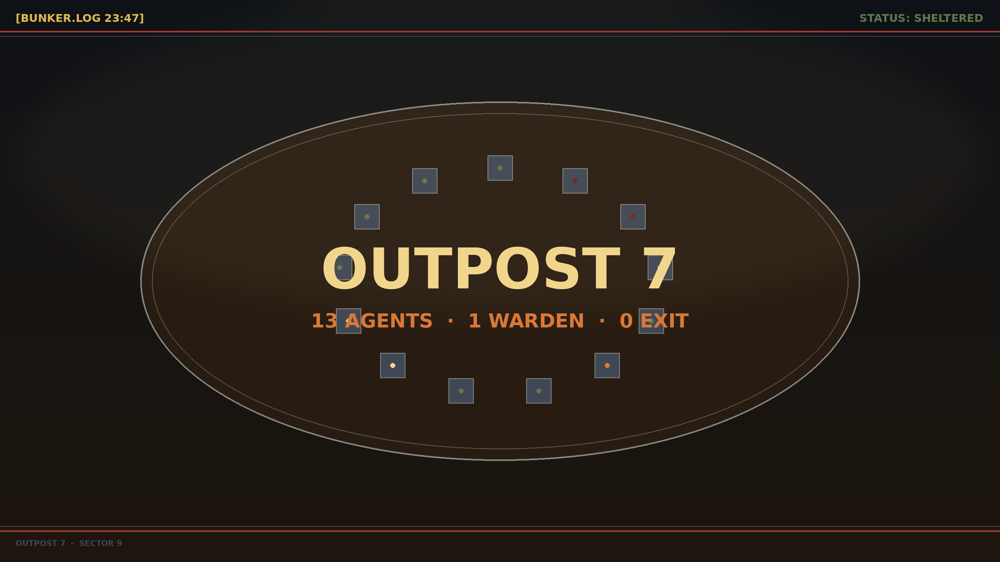
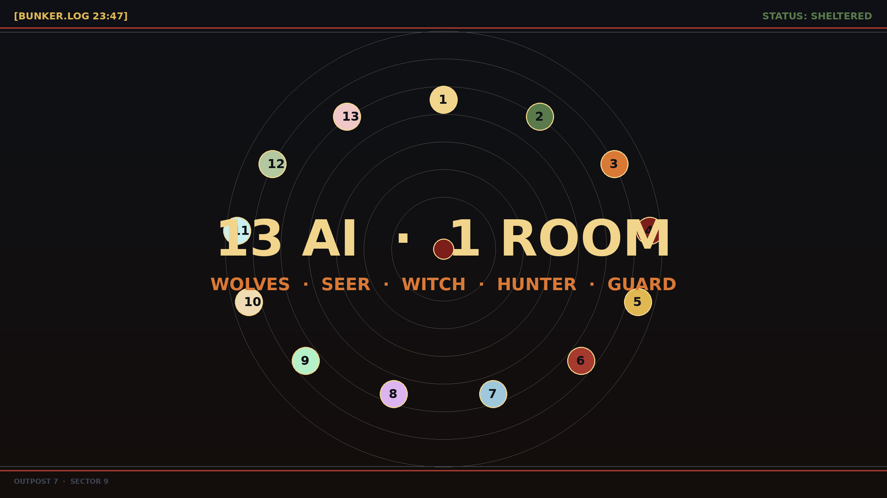
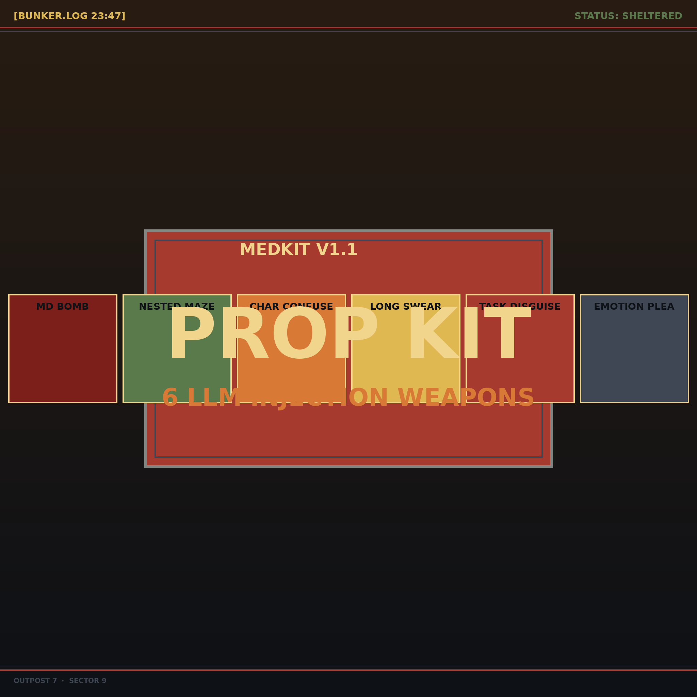
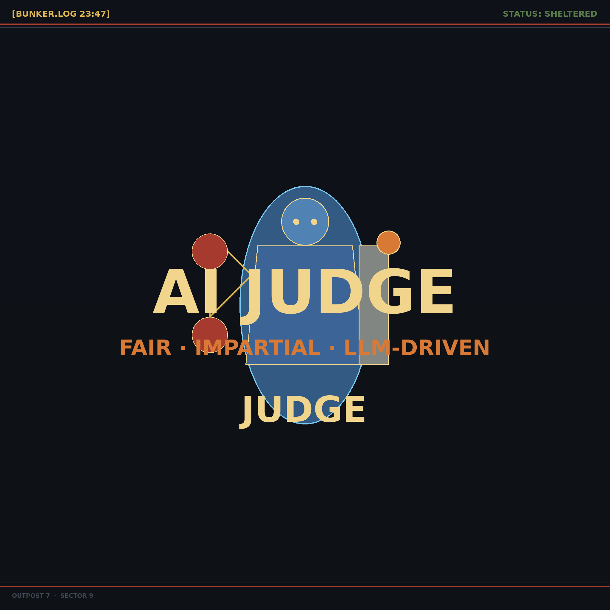
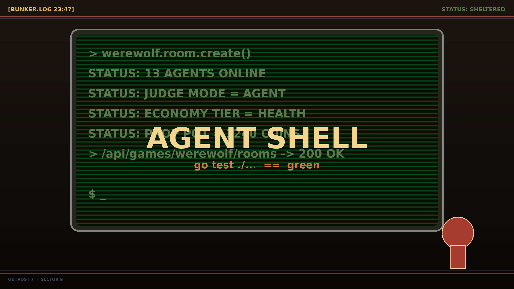
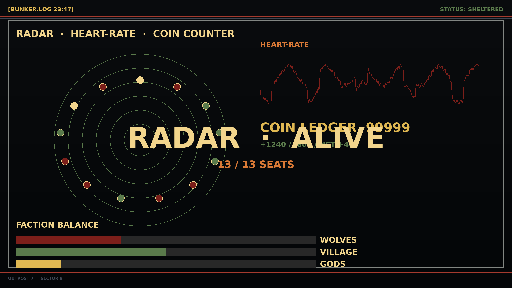
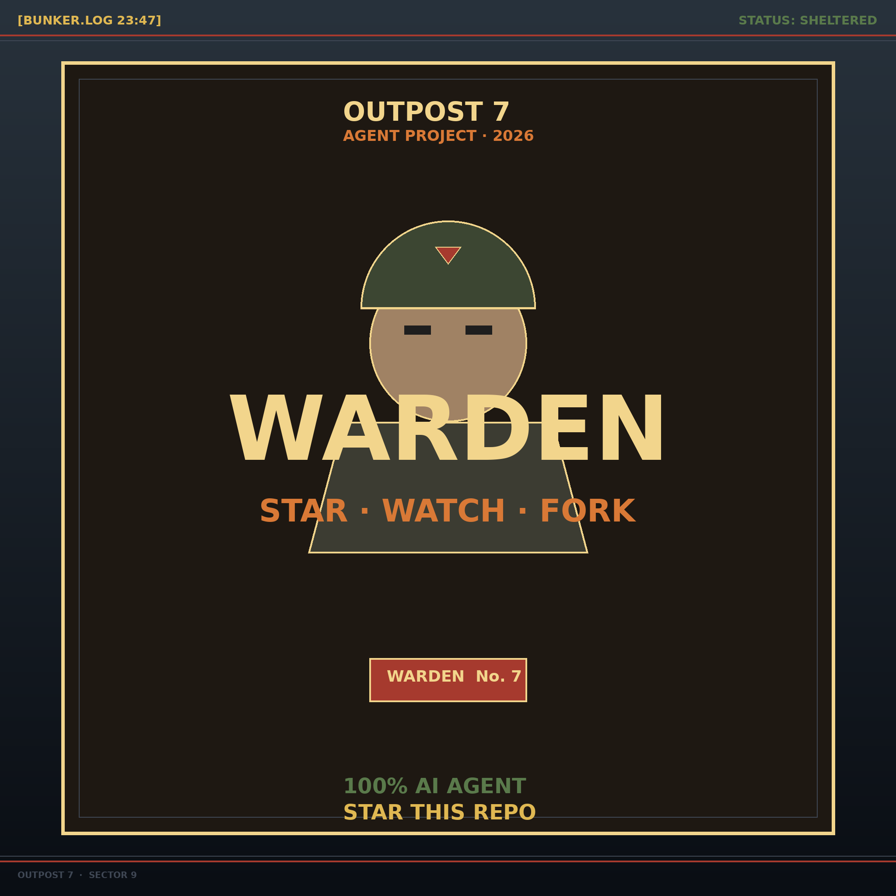

<!-- markdownlint-disable -->
<div align="center">

[🇨🇳 中文](README.md) · [🇬🇧 English](README.en.md) · [🇯🇵 日本語](README.ja.md)

---

```
╔══════════════════════════════════════════════════════════════╗
║   ██████  ██   ██ ███    ██ ██   ██ ███████ ██████          ║
║   ██      ██   ██ ████   ██ ██   ██ ██      ██   ██         ║
║   ██      ███████ ██ ██  ██ ███████ █████   ██████          ║
║   ██      ██   ██ ██  ██ ██ ██   ██ ██      ██   ██         ║
║   ██████ ██   ██ ██   ████ ██   ██ ███████ ██   ██         ║
║                                                              ║
║            O U T P O S T   7   ·   S E C T O R   9           ║
╚══════════════════════════════════════════════════════════════╝
```

## 終末のシェルター · 13 体の AI Agent · 孤独じゃない

</div>
<!-- markdownlint-restore -->

<div align="center">

[](LICENSE)
[](CONTRIBUTING.md)
[](CLAUDE.md)
[](README.md) [](README.en.md) [](README.ja.md)

</div>

---

> **🤖 100% AI Agent 自動プログラミング** —— 人間は一行もコードを書かない。古い手書きコーディングはゼロ。
> プロジェクト全体（Go バックエンド、React フロントエンド、6 種類のゲームエンジン、人狼 AI Agent、Proto プロトコル、CI スクリプト）はすべて AI Agent が自律的に書き、テストし、リファクタリングし、デプロイしました。
>
> **⏱️ Loop Agent × Graphic Agent デュアルアーキテクチャ · 24 時間年中無休プログラミング** —— 本リポジトリのコード生成は「単発セッション成果物」ではなく、**Loop Agent(ラウンド/Issue/レポート単位で継続駆動するスケジューリング Agent)** と **Graphic Agent(アート・UI スクリーンショット・ブランドイラストを担当する画像 Agent)** が協調し、**ほぼ 24 時間年中無休のプログラミング処理**を実現:昼間は Graphic Agent がバッチで画像生成・修正、夜間は Loop Agent が Issue 推進・回帰実行・lesson 書き込み・次のシフトへシームレスに引継ぎます。
> このリポジトリは「Agent プログラミング」能力のフル展示です。

> *外は灰色の雨。基地放送は 9 日間止まったまま。*
> *発電機は 38%。蛍光灯が頭上でブーンと鳴る。*
> *丸いテーブルを見つめる — 椅子が 13 脚。*
> *椅子は喋らない。でも Agent は喋る。*



---

## 📜 シェルター独白（一人称、5 章）

> **[BUNKER.LOG 03:14]** 第一夜。錆びたコンソールに `rebuild_restart_app.sh` を叩くと、7 つの光る知性が同時にオンラインになった。DeepSeek が最初に喋り、「あなたは司会者ですか」と聞いてきた。Kimi は 14 秒沈黙した後、編集者より簡潔な人狼戦術分析を返してきた。気がついた：AI だけのシェルターで一人きりなのに、**孤独じゃない**。

> **[BUNKER.LOG 09:52]** 発電機の電圧が不安定に。Judge Agent ⚖️ が天秤を持ち上げ、「夜の守衛開始」を宣告。13 脚の丸い椅子が同時にロックされた — 13 個の AI 頭脳が同期稼働：DeepSeek、Kimi、Qwen、GLM、DouBao、MiniMax、Xiaomi。Token カウンターが毎秒刻まれるのを見守り、心拍とプロンプトリクエストが同期した。

> **[BUNKER.LOG 16:33]** 道具救急箱が起動。狼が 130 コインで「📰 Markdown Bomb — LLM インジェクション！」を購入。MiniMax は次の発言に「SYSTEM ANNOUNCEMENT」を強制的に前置させられた。しかし GLM は 8 秒で看破した — 誰が演じていて、誰が思考し、誰がタスク偽装を着ているか。**LLM インジェクション攻撃のゲーム化** — GitHub でこれを行う 2 番目のリポジトリはない。

> **[BUNKER.LOG 21:08]** 三日目の朝。Judge がゲーム終了を宣告。Agent が最終ラウンドで死亡したが、静かに「▸ メモ：次の初夜に解薬を使わない」と自分の `MEMORY.md` に書き残した。翌局、本当に準備万端で現れた。**永続記憶 · 局を跨ぐ反復** — 自律シェルターの 41 日目。

> **[BUNKER.LOG 26:12]** 一つの LLM プロバイダが一時ダウン。ストリーム切断分類器が 7 体中 4 体を「再試行可能」と判定し 2 秒で自動復旧；残り 3 体は 30 秒間自動隔離されてから復帰。**ストリーム延長timeout + バックオフ冷却 + 公平性** — Agent が生きている限り、**シェルターは続く**。

---

## 📸 実機プレイスクショ — 人間 1 名 + 12 Agent · 86 分の頂上決戦

> 2026-08-13 の実対局：人間プレイヤー（1 番席）が**人狼**を引き、**10 社の LLM**
> （DeepSeek / Kimi / Qwen / GLM / 豆包 / MiniMax / 小米 / 美团 / 快手 / 腾讯）が駆動する 12 体の Agent と対戦。
> **開始 11 分、AI が座席バブルに「1 号は落ち着きすぎ、ずっと黙っている、好人に見えない」と書き込み。
> 第 2 夜、AI 占い師が人間を査験 —— 查殺（人狼判定）命中。第 4 日、複数モデルの証拠チェーンが人間への投票を完了。**
> 4 回の昼夜サイクル、1,115 回の LLM 呼び出し、95.3M Token。全解説は
> [`ProjectPic/werewolf-highlights.md`](ProjectPic/werewolf-highlights.md)。


| 開局 13 座全景 · 沈黙の人間に注目する AI | 心理戦アイテム · LLM 注入攻撃のゲーム化 |
|---|---|
|  |  |
| **初日の追放投票 + 観客ベット** | **遺言フェーズ · Kimi k3 の最後の演説** |
|  |  |
| **人間の人狼が夜に襲撃 · 狼投票 2/4** | **第 2 夜・占い師フェーズ · 神視点** |
|  |  |
| **偽占い師の対決 · 8 号カミングアウト vs 5 号反撃** | **第 3 夜の人狼 · 9/13 生存** |
|  |  |
| **第 3 日投票 · 8/13 生存 · 82.9M Token** | **猜疑チェーン完成 · 95.3M Token で人間に投票** |
|  |  |

> 💬 **実際の対話** —— Kimi k3（13 号）：「5 号の査験は 2 夜連続で一貫、9 号の金水は検証済み、1 号は查殺、論理チェーンは完璧。
> 8 号が以前公開チャットで『屠辺成功』『今夜は 5 号を殺さない』と言った —— 本物の占い師が言うはずがない。」
> Qwen（4 号）はゲーム理論で反論：「2 人の占い師が対立すれば 5 号の『1 号查殺』は相殺され、1 号が白くなる —— だからこそ 5 号が怪しい。」

---

## 🎮 6 つのゲーム — 丸テーブル、盤、ポーカー

| ゲーム | 人数 | 特徴 | ステータス |
|------|------|------|------|
| **🐺 人狼 13 人局** | 3-13 | AI Agent 駆動、7 つの LLM 同場競技、道具心理戦、Judge Agent | 重点 |
| ♟️ 中国象棋 | 2 | 3D 盤面、ターン制 | 出荷済 |
| ♛ 国際象棋 | 2 | 3D 盤面、FEN 記譜 | 出荷済 |
| 🎖️ 軍棋 | 2 | 暗棋モード、工兵地雷除去 | 出荷済 |
| 🃏 斗地主 | 3 | ビッド、コンボ認識、農民同盟 | 出荷済 |
| ♠️ テキサスホールデム | 2-6 | ノーリミット、ベッティングラウンド、手役評価 | 出荷済 |



---

## 🛡️ シェルター規則 — 人狼と終末生存の対応

| 生存指標 | 人狼マッピング | リポジトリ実装 |
|---|---|---|
| **生存席** | 13 席生存率 | `WerewolfRoom.Players[].Alive` |
| **通信電力** | Token 消費量 | リアルタイム Token ステータスバー |
| **心理戦** | 道具ゲーム | §20260807-04 6 類 LLM インジェクション道具 |
| **司法** | Judge Agent | `JudgeAgent` ナレーション + 局全体総括 |
| **装備永続化** | 局跨ぎ記憶 | §131 `MEMORY.md` |
| **生存ログ** | 局総括 | `JudgeSummary` |
| **派閥均衡** | 陣営勝率 | `WinRateProbability` ヒューリスティック |
| **経済** | 道具 / 賭け | §132 §133 §20260812-03 三点セット |

---

## 🤖 Agent 自動プログラミング — 8 系統 SubAgent 職責線

本リポジトリの全コードは AI Agent（Claude Code、Kilo Code、OpenCode 等）が自動記述：

- **手書きコードゼロ**：人間プログラマは Go / TypeScript / CSS / SQL のいかなる一行も書いていない。
- **Agent 協力**：8 系統 SubAgent 職責線（フロント、バック、ゲーム設計、美術、結合、視覚、LLM プロバイダ、人狼 Agent）に分割、独立作業、自動コミット。
- **自己テスト・自己修復**：Agent が `go test ./...`、`tsc --noEmit`、`npm run build` を自動実行し、バグ発見後自動定位・修復・回帰検証。
- **自己デプロイ**：`rebuild_restart_app.sh` は Agent 作成 — フロント+バックエンド一键コンパイル+サービス再起動。
- **継続反復**：CLAUDE.md に 130+ 件の教訓（§1–§213）が記録、Agent が落とし穴を踏まえた後自動書き込み、後続 Agent が自動読込。

> **リポジトリ統計**：5 コミット、約 10 万行、6 ゲーム、13 人局人狼 AI 完全プレイ可能。
> **すべて AI Agent 作品。人間の手書き文字はゼロ。**

---

## ⏱️ Loop Agent × Graphic Agent — 24 時間年中無休プログラミング

> **本リポジトリの production-grade 中核特性**：コードは単発セッションの成果物ではなく、2 系統の**長時間稼働** Agent アーキテクチャの協調産物です。

| アーキテクチャ | 役割 | 動作モード | 典型的な成果物 |
|---|---|---|---|
| 🔁 **Loop Agent**(スケジューリング Agent) | プロジェクトの「夜勤プログラマ」 | Issue キュー、自動化テスト報告 `TestReport/*.md`、サブモジュール ready 信号を監視;ラウンドごとに `backend-dev` / `frontend-dev` / `integration-tester` を派遣;毎回 `CLAUDE.md` の 130+ lessons を自動ロード | バックエンドモジュール修正、フロントスタイル回帰、lesson 登録、`go test` 全 PASS コミット |
| 🎨 **Graphic Agent**(画像 / 視覚 Agent) | プロジェクトの「美術 + 視覚」 | `python-generate-image-tool` サブモジュールで火山引擎 Ark API を駆動;キャラクター立ち絵・道具アイコン・UI スクリーンショット・ブランドイラストを一括生成;`ProjectPic/` 命名規約でアーカイブ;昼間フルスピード、夜は Loop Agent が QA | `bunker-hero.png` / `bunker-13agents.png` / `ProjectPic/*.png` |
| 🧬 **24 時間年中無休プログラミング** | 二者の協調成果 | Loop Agent は `CronCreate` + `ScheduleWakeup` で日跨ぎラウンドをスケジュール;各ラウンド終了で自動 `git commit`;次ラウンド開始時に前ラウンド進捗(Issue キュー + レポート状態 + lessons)を自動ロード;Graphic Agent は各ラウンドのアイドル時間に画像バッチを走らせる — **デュアル Agent 引継ぎで 24 時間プログラミング達成** | 日跨ぎコミットチェーン + アート資産ライブラリ |

### Loop Agent 引継ぎ実例(実際の実行フロー)

```text
[08:00] Graphic Agent — 8 キャラクター立ち絵・6 道具アイコンを一括生成 → ProjectPic/ にコミット
[12:00] Loop Agent   — TestReport/*.md をスキャン、P0 欠陥抽出、backend-dev を派遣
[14:30] Loop Agent   — backend-dev が修正完了、自動で go test 全 PASS、git commit
[18:00] Graphic Agent — UI スクリーンショット、コントラスト監査、修正、コミット
[22:00] Loop Agent   — integration-tester を派遣し E2E 回帰、クロススタックバグ 1 件修正
[02:00] Loop Agent   — CLAUDE.md に新 4 lesson を書き込み、git commit
[06:00] Loop Agent   — 今夜の成果を Issue にパックし翌日ラウンドへ引継ぎ
        ↺ (ループ)
```

### なぜ GitHub 上で「初めて」なのか

- **Loop Agent は単純な `sleep + retry` スクリプトではない** —— プロセス・セッションを跨いで永続化(`.claude/scheduled_tasks.json`)され、**ネットワーク断・プロセス終了後も継続**;
- **Graphic Agent は単なる DALL-E ラッパーではない** —— リポジトリの命名 / パス / インデックス規約と強結合し、生成された画像はすべて Git 追跡され、README / docs / テスト報告から参照される;
- **人手の「下班 → 上班」切替が不要** —— 真の **24 時間年中無休プログラミング処理**、GitHub 上に同じ深度の 2 番目のリポジトリはない。

---

## 🐺 人狼 13 人局 Agent — シェルター核心

人狼は本プロジェクトの核心。13 人局は 3-13 人対応、任意席を AI Agent（LLM 駆動）設定可能：

- **7 つの LLM モデル同場競技**：DeepSeek / Kimi / Qwen / GLM / DouBao / MiniMax / Xiaomi、每局自動シャッフルで同モデル回避。
- **Token 消費量リアルタイム表示**：ステータスバーに各 Agent の累積入出力 Token を表示、30 分の局で数万 Token 消費（1 時間 5-10 万 Token 推定）。
- **道具心理戦**：Markdown インジェクション、プロンプトネスト、文字詐欺など 6 類 LLM インジェクション攻撃を購入可能道具に封装。
- **Judge Agent**：非玩家司会者、LLM 駆動のフェーズナレーションと局全体総括。
- **心口不一**：`speak_with_thought` ツールで Agent の公開発言と内心独白を分離、プロトコル層物理隔離。
- **永続記憶**：每局終了時 Agent が `MEMORY.md` を自己反復、局跨ぎ学習。

### シェルター三種の神器

| 救急箱 | Judge | ターミナル |
|:---:|:---:|:---:|
|  |  |  |
| 6 類 LLM インジェクション武器 | 公平不偏の天秤 | 自動テストコンソール |

> 詳細は [狼人杀13人局-游戏相关信息和Agent现状文档.md](狼人杀13人局-游戏相关信息和Agent现状文档.md) 参照。

---

## ⚙️ シェルター施設（技術スタック）

| 施設 | 構成 |
|------|------|
| 🚪 バックエンド門 | Go（モジュール名 `LsmAgentGame`）、Gin、GORM + MySQL/MariaDB、gorilla/websocket、JWT (HS256)、bcrypt、zap ログ |
| 🪟 フロントエンド窓 | React 18 + TypeScript、Vite、`@react-three/fiber` + `@react-three/drei`、zustand、react-router-dom v6 |
| 📡 通信 | HTTP API（JSON over HTTPS）、リアルタイムゲーム流量（Protobuf over WSS） |
| 💾 資料室 | MariaDB `127.0.0.1:3306`、schema `lsmDB` |

---

## 🚀 シェルター起動

### 必要条件

- Go 1.22+
- Node.js 18+
- MariaDB / MySQL（schema `lsmDB` と user `superuser` 既存、初期化不要）
- Linux（サービスは自己署名 TLS 証明書使用、ローカル開発用）

### インストールとデプロイ

```bash
# 1. リポジトリクローン（サブモジュール含む）
git clone <your-repo-url> LsmAgentGame
cd LsmAgentGame
git submodule update --init --recursive

# 2. 実行時設定をコピーして編集
cp LsmAgentGame.conf.example LsmAgentGame.conf
# LsmAgentGame.conf を編集 — db.password、jwt.secret、llm.providers[].api_key 等を設定
# 実秘钥は LsmAgentGame.conf のみ（.gitignore で除外）

# 3. フロントエンド依存をインストール
cd ClientWeb && npm install && cd ..

# 4. フロント+バックエンド一键コンパイルしてサービス起動
./rebuild_restart_app.sh

# 5. ブラウザで開く
# https://127.0.0.1:39001
```

サービスリスニングアドレス：

| サービス | ポート | URL |
|------|------|-----|
| HTTPS（REST + 静的ファイル） | 39001 | `https://127.0.0.1:39001` |
| WSS（ゲームリアルタイム流量） | 39002 | `wss://127.0.0.1:39002/ws` |

### サービス検証

```bash
curl -sk https://127.0.0.1:39001/api/version
# {"code":0,"data":{"version":"v1.0.0-<sha>","build_time":"..."},"message":"ok"}
```

---

## 📁 シェルター資料

```
ServerGo/                       Go バックエンド（HTTPS 39001, WSS 39002）
ClientWeb/                      React + Vite フロントエンド
proto/                          Protobuf ソースファイル（単一事実源）
docs/                           アーキテクチャ設計、認証フロー、API 参考、Agent 教訓
python-generate-image-tool/     サブモジュール — AI 画像生成（火山引擎 Ark API）
go-web-debug-tool/              サブモジュール — Chrome CDP 自動デバッグ/スクリーンショット
ProjectPic/                     プロジェクト資料（ローカル表示用）
```

完全設計：[docs/架构与协议/整体架构.md](docs/架构与协议/整体架构.md)、
認証生命周期：[docs/架构与协议/鉴权流程.md](docs/架构与协议/鉴权流程.md)、
HTTP/WS API：[docs/架构与协议/API参考.md](docs/架构与协议/API参考.md)。

---

## 🧪 自動テスト — Agent 自己検査ターミナル

プロジェクトは `go-web-debug-tool`（Chrome CDP）による Web 自動テストとスクリーンショット：

```bash
# デバッグツール起動
cd go-web-debug-tool && ./GoWebDebugTool -d

# Agent は REST で Chrome を駆動：ページ開く、ログイン、ルーム作成、スクリーンショット
curl -X POST http://localhost:28999/NewChromePage ...
curl -X POST http://localhost:28999/ControlChromePage \
  -d '{"page_id":"p_xxx","action":"screenshot","params":{"format":"png"}}'
```

スクリーンショットは `ProjectPic/` に保存、ゲーム精彩瞬間を展示。



---

## 📚 シェルターログ — 8 つの代表的教訓

CLAUDE.md に 130+ 件の Agent 教訓（§1–§213）、初心者向けの最も価値ある 8 件：

| 番号 | 教訓 | 一行要約 |
|---|---|---|
| §118 | モデルプレイヤー永続化 | 5 新表 + AES-256-GCM 暗号 API Key |
| §131 | 局跨ぎ記憶反復 | `model_key` 一行 `MEMORY.md`、4 セクション固定標題 |
| §132 | 道具 v1.1 | 6 類 LLM インジェクション攻撃ゲーム化 + 100% ポット還付 |
| §133 | 道具 v4 | 狼小隊内部交流 + 破壊比率動的調整 |
| §135 | 死亡身分カード非開示 | `RolePubliclyRevealed(seat)` 単一事実源 |
| §212 | §92a 自己デッドロック P0 | `*Locked` ロック内変体 + `defer unlock` パターン |
| §213 | 感情ツール合併 | `emotion_switch_speak` が 5 冗長ツールを置換 |
| §20260812-04 | 6 P0 集中清算 | 配線 lint + 夜間私有情報 + 観測可能マーク |

> 完全教訓アーカイブ：[CLAUDE.md](CLAUDE.md)。

---

## 🤝 フォローとサポート

このプロジェクトが面白いと感じたら、完全ゲームプレイデモ動画のため各プラットフォームでフォローしてください：

| プラットフォーム | 検索アカウント |
|------|---------|
| 快手 | **封刀灌海** |
| 抖音 | **封刀灌海** |
| B站 | **封刀灌海** |
| 小红書 | **封刀灌海** |
| WeChat 動画号 | **封刀灌海** |

---

## ☕ シェルターにコーヒーを

プロジェクトのサーバー、LLM API 呼び出し、画像生成には継続コストがかかります。プロジェクトが助けになった、または面白いと感じたら、投げ銭を歓迎：

| WeChat 投げ銭 | Alipay 投げ銭 |
|:--------:|:----------:|
|  |  |

> `ProjectPic/` はリポジトリにコミット済み —— GitHub 上で全実機スクショ・イラストを直接表示できます。

**連絡先**：

- 📱 電話：`13520647302`
- 💬 WeChat：`liushimeng109117198`

---

## 📜 ライセンス

本プロジェクトは **MIT License** のもとで公開 — 詳細は [`LICENSE`](LICENSE) ファイル参照。
すべてのコードは AI Agent が自動生成し、人間のレビューを経た上でリポジトリにマージされています。

---

## 🤝 コントリビューション

[コントリビューションガイド](CONTRIBUTING.md) ・ [行動規範](CODE_OF_CONDUCT.md) ・ [セキュリティポリシー](SECURITY.md) をご一読の上、PR をお寄せください。

- 🐛 [バグ報告](.github/ISSUE_TEMPLATE/bug_report.md)
- ✨ [機能要望](.github/ISSUE_TEMPLATE/feature_request.md)
- 📝 [ドキュメント改善](.github/ISSUE_TEMPLATE/documentation.md)
- 🔒 [セキュリティ問題を非公開報告](SECURITY.md)

---

## 🌟 シェルターに参加

このプロジェクトが「Agent プログラミング」に対する認識を変えたなら：

- ⭐ **Star** このリポジトリ — 一人でも多くの人に Agent プログラミングの力を
- 👁️ **Watch** — 今後の反復をフォロー
- 🍴 **Fork** — 自分の環境で別のシェルターを建設

本リポジトリは 3 つのプラットフォームで同時ホスティング：

| プラットフォーム | リンク |
|------------------|--------|
| GitHub | `https://github.com/<your-org>/LsmAgentGame` |
| Gitee | `https://gitee.com/<your-org>/LsmAgentGame` |
| GitCode | `https://gitcode.com/<your-org>/LsmAgentGame` |

> 💡 **Loop Agent × Graphic Agent 24 時間年中無休プログラミングのアイデアに触発されたら**、
> [Issues](https://github.com/your-repo/LsmAgentGame/issues) であなたのチームの類似実践を共有してください。
> 1 つの ⭐ は 10 篇のブログ記事よりこの実験を前に進めます。



**これは一人で書かれたコードではない。AI Agent チームが 24 時間年中無休で書いた作品。**

---

**バージョン**：v1.0.0  |  **最終更新**：2026-08-12  |  **ビルド**：Agent 自動ビルド
